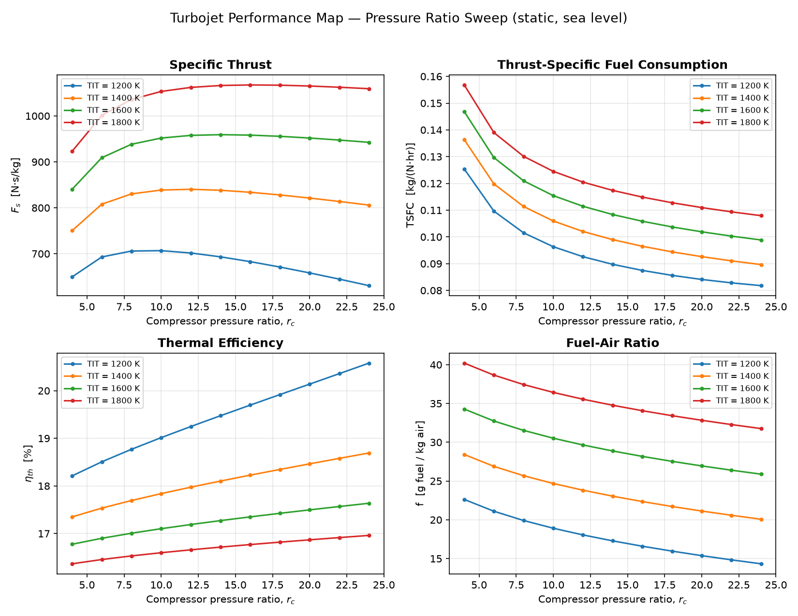
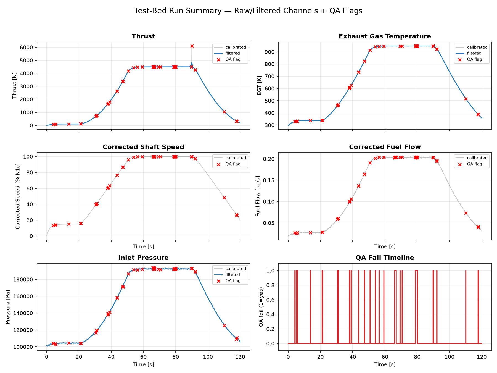
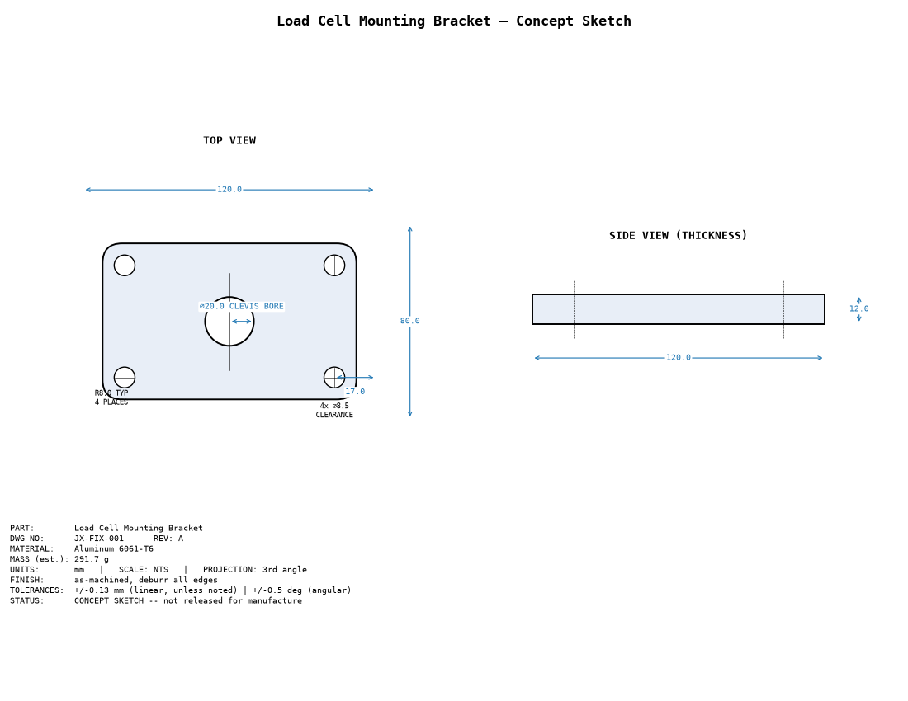

# JetX Engine Performance & Testing Portfolio

[](https://github.com/samaldivyanshu926-art/divi/actions/workflows/tests.yml)
[](https://www.python.org/downloads/release/python-3120/)
[](LICENSE)
[](https://github.com/astral-sh/ruff)

Three self-directed engineering projects built to close the gap between a
Mechanical Engineering background and the stated requirements of an
**Engine Performance & Testing Engineer** role: gas-turbine cycle
performance analysis, test-cell instrumentation & data reduction, and
test-stand hardware design.

Everything here is a working, tested, documented Python package — not
slides describing what could be built.

## Contents

- [What's in this repository](#whats-in-this-repository)
- [Quick start](#quick-start)
- [Project 1 — Turbojet Performance Simulator](#project-1--turbojet-performance-simulator)
- [Project 2 — Test-Bed Data Reduction](#project-2--test-bed-data-reduction)
- [Project 3 — Test-Stand Fixture](#project-3--test-stand-fixture)
- [Repository layout](#repository-layout)
- [Testing](#testing)
- [Documentation](#documentation)
- [Honest scope](#honest-scope)

## What's in this repository

| | |
|---|---|
| **Language** | Python 3.12, fully type-hinted, PEP 8 |
| **Core libraries** | numpy, pandas, matplotlib, scipy, plotly |
| **Tests** | 62 passing pytest unit/integration tests, zero I/O or network dependency |
| **CI** | GitHub Actions — lint (ruff) + test suite + smoke-run all three project scripts on every push |
| **Docs** | Installation guide, full mathematical derivations, assumptions & limitations, architecture, future work |

## Quick start

```bash
python3.12 -m venv .venv && source .venv/bin/activate
pip install -r requirements.txt

pytest tests/ -v                                  # 62 tests, ~1s

python scripts/run_project1_cycle_sweep.py         # -> data/, figures/ for Project 1
python scripts/run_project2_data_reduction.py      # -> data/, figures/ for Project 2
python scripts/run_project3_fixture_drawing.py     # -> data/, figures/, docs/ for Project 3
```

Full walkthrough: [`docs/installation.md`](docs/installation.md).

---

## Project 1 — Turbojet Performance Simulator

A station-by-station, real-cycle (non-ideal) thermodynamic model of a
single-spool turbojet — intake, compressor, combustor, turbine, nozzle —
built from standard gas-turbine cycle relations (Cohen, Rogers &
Saravanamuttoo; Mattingly). Every equation is derived in
[`docs/engineering_theory.md`](docs/engineering_theory.md).

**Implements:** Brayton cycle, compressor (isentropic efficiency),
combustor (energy-balance fuel-air ratio), turbine (work-balanced against
the compressor), convergent nozzle (choked/unchoked), specific thrust,
TSFC, thermal efficiency, propulsive efficiency, overall efficiency.

**Generates:** CSV performance tables, pressure-ratio sweeps,
turbine-inlet-temperature sweeps, publication-quality performance maps.

```bash
python scripts/run_project1_cycle_sweep.py
```



At `rc=12`, TIT=1400 K, static sea level: **specific thrust = 840 N·s/kg,
TSFC ≈ 1.0 lb/(lbf·hr)** — consistent with published static TSFC for this
engine class. Full results: [`reports/project1_turbojet_performance_report.md`](reports/project1_turbojet_performance_report.md).

## Project 2 — Test-Bed Data Reduction

A complete test-cell DAQ pipeline: sensor calibration models (load cell,
thermocouple, pressure transducer, RPM sensor), synthetic raw-signal
generation, Butterworth noise filtering, ISA-referenced corrected-speed
normalisation, automated QA flagging, and an interactive dashboard.

```bash
python scripts/run_project2_data_reduction.py
```



All three deliberately-injected instrumentation faults (a thermocouple
dropout, a stuck pressure-transducer reading, and a load-cell EMI spike)
are **correctly caught** by the automated QA rules — verified against the
raw log and by unit test. Open `figures/project2/dashboard.html` for the
interactive version. Full results: [`reports/project2_test_data_reduction_report.md`](reports/project2_test_data_reduction_report.md).

**Honesty note:** the raw data is simulated — there is no physical rig
behind it. The calibration/filtering/QA pipeline is real, general-purpose
code that operates unchanged on genuine DAQ output; that pipeline is the
skill being demonstrated.

## Project 3 — Test-Stand Fixture

A dimensioned 2D concept sketch (not parametric CAD) for the load-cell
mounting bracket that carries a test-stand load cell between the engine
thrust frame and the stand structure — precise enough to hand straight to
CAD modelling.

```bash
python scripts/run_project3_fixture_drawing.py
```



**Generates:** dimensioned PDF/SVG/PNG drawing, exact DXF export (true
`ARC` entities for the fillets, not a polyline approximation), bill of
materials, material-selection trade study, manufacturing notes. Full
results: [`reports/project3_test_stand_fixture_report.md`](reports/project3_test_stand_fixture_report.md).

**Next step (not yet done):** model this as a real parametric part in
Siemens NX or CATIA V5, with a GD&T-annotated manufacturing drawing —
tracked in [`docs/future_work.md`](docs/future_work.md).

---

## Repository layout

```
jetx-engine-performance-portfolio/
├── src/jetx/           # the installable package (cycle/, daq/, fixture/, common/)
├── scripts/            # one CLI entry point per project
├── tests/              # 62-test pytest suite, mirrors src/ layout
├── data/                # generated CSV outputs (tracked, fully reproducible)
├── figures/             # generated PNG/PDF/SVG/HTML outputs (tracked, fully reproducible)
├── docs/                 # installation, theory/derivations, assumptions, architecture, future work
├── reports/              # per-project written results reports
├── notebooks/            # exploratory Jupyter notebooks (pre-executed, outputs included)
├── presentations/        # slide-style portfolio summary (Marp/reveal.js-compatible markdown)
├── requirements.txt
├── pyproject.toml
└── LICENSE
```

See [`docs/architecture.md`](docs/architecture.md) for the design rationale
behind this layout (physics / orchestration / I/O layering, used
identically in all three projects).

## Testing

```bash
pytest tests/ -v
```

62 tests covering the ISA atmosphere model, every cycle component, the
full engine integration, the sweep utilities, all four sensor
calibrations, the calibration pipeline, both filters, corrected-speed
math, QA fault detection (including the three deliberately-injected
faults), bracket geometry/strength checks, DXF export structure, and BOM
generation. No test touches the filesystem outside `tmp_path` fixtures or
requires network access.

## Documentation

| Document | Contents |
|---|---|
| [`docs/installation.md`](docs/installation.md) | Setup, running each project, troubleshooting |
| [`docs/engineering_theory.md`](docs/engineering_theory.md) | Every equation, derived, with the source module/function named |
| [`docs/assumptions_and_limitations.md`](docs/assumptions_and_limitations.md) | Every deliberate simplification, and its measured/analytical consequence |
| [`docs/architecture.md`](docs/architecture.md) | Repository layout and design rationale |
| [`docs/future_work.md`](docs/future_work.md) | Concrete next steps per project |
| [`docs/fixture_material_selection.md`](docs/fixture_material_selection.md) | Material trade study for the bracket |
| [`docs/fixture_manufacturing_notes.md`](docs/fixture_manufacturing_notes.md) | Process, tolerances, inspection plan |

## Honest scope

This was built as a portfolio to demonstrate engineering thinking and
software craftsmanship, not a claim of prior propulsion-industry or
flight-test experience. Every simplifying assumption — the two-constant-
cp gas model, the convergent-only nozzle, the linear thermocouple
approximation, the synthetic test data, the concept-sketch (not released)
status of the fixture drawing — is documented in
[`docs/assumptions_and_limitations.md`](docs/assumptions_and_limitations.md)
rather than left implicit. Where the model produces a counter-intuitive
result (e.g. thermal efficiency not improving monotonically with turbine
inlet temperature under a choked convergent nozzle), that result is
reported and explained, not smoothed over.

## License

[MIT](LICENSE)
